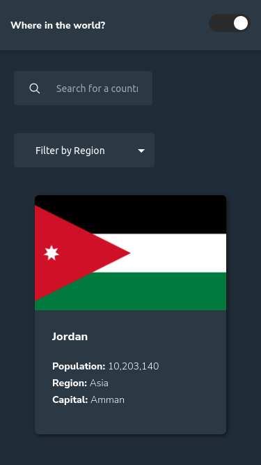
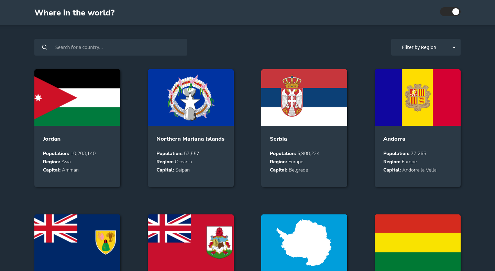
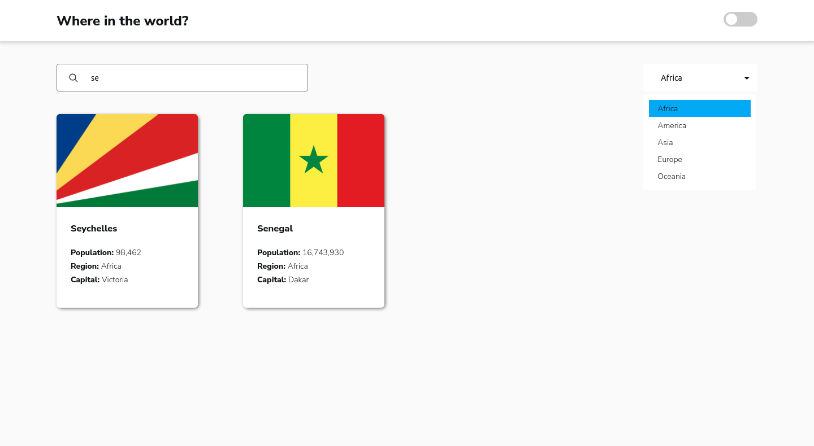

# REST Countries API with color theme switcher

My solution for the [REST Countries API with color theme switcher challenge on Frontend Mentor](https://www.frontendmentor.io/challenges/rest-countries-api-with-color-theme-switcher-5cacc469fec04111f7b848ca) using _Angular_.

- [Live Site](https://rest-countries-api-gmaitor.vercel.app/)

## Table of contents

- [Overview](#overview)
  - [The challenge](#the-challenge)
  - [Screenshot](#screenshot)
  - [Links](#links)
- [My process](#my-process)
  - [Built with](#built-with)
  - [What I learned](#what-i-learned)
- [Author](#author)

## Overview

### The challenge

Users should be able to:

- See all countries from the API on the homepage
- Search for a country using an `input` field
- Filter countries by region
- Click on a country to see more detailed information on a separate page
- Click through to the border countries on the detail page
- Toggle the color scheme between light and dark mode _(optional)_

### Screenshot

<table>
        <tr>
            <td>
                
            </td>
		        <td>
                
            </td>
            <td>
                
            </td>
            </tr>
</table>

### Links

- Solution URL: [Add solution URL here](https://your-solution-url.com)
- Live Site URL: [https://rest-countries-api-gmaitor.vercel.app/](https://rest-countries-api-gmaitor.vercel.app/)

## My process

### Built with

- Semantic HTML5 markup
- CSS custom properties
- Flexbox
- CSS Grid
- TypeScript
- [Angular](https://reactjs.org/) - Web Framework
- [RxJS](https://rxjs.dev/) - Reactive Library

### What I learned

Through this project, I had the opportunity to revisit and reinforce fundamental concepts in Angular:

- Using the **_Angular CLI_**.
- Working with a module based system.
- Using core modules such as **_Routing_**.
- Using directives such as **_NgModel_**.
- Working with **_RxJS_** to deal with reactivity flow.
- Using a strongly typed programming language such as **_TypeScript_**.

- I learnt a workaround for styled svgs in Angular:

```ts
import { Component, HostBinding, Input } from "@angular/core";

@Component({
  selector: "app-svg-icon",
  templateUrl: "./svg-icon.component.html",
  styleUrls: ["./svg-icon.component.css"],
})
export class SvgIconComponent {
  @HostBinding("style.-webkit-mask-image")
  private _path!: string;

  @Input()
  public set path(filePath: string) {
    this._path = `url("${filePath}")`;
  }
}
```

```html
<app-svg-icon class="search-icon theme-color-as-background" [path]="'assets/search-icon.svg'"></app-svg-icon>
```

- Found that I could not style _options_ inside a **_select_** tag, so i had to find an alternative to achieve the design proposed by the challenge. I did use this [tutorial](https://www.youtube.com/watch?v=-0VuZEYIYuI&t=142s) to create a list and use it as _options_ but keeping the accesibility.

- Used a dictionary, in this case a TS map to easily retrieve the country name based on its abbreviation.

```ts
private countryNamesDictionary = new Map<string, string>();

public getContryName(cca3:string) : string | null{
  return this.countryNamesDictionary.get(cca3) ?? null;
}
```

```html
<div>
  <span
  class="span-items theme-background theme-color"
  *ngFor="let countryName of country.border_countries"
  (click)="goToBorderCountry(countryName)"
  >{{ countryService.getContryName(countryName) }}
</span>
</div>
```

## Author

- Frontend Mentor - [@AitorGallardo](https://www.frontendmentor.io/profile/AitorGallardo)
